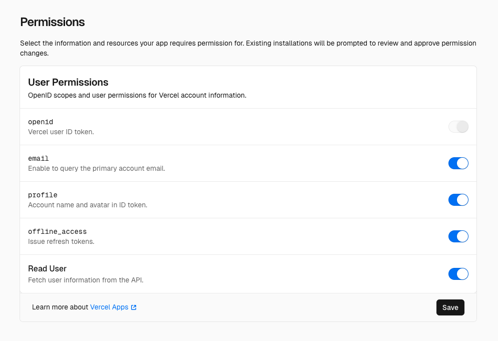

# Sign in with Vercel - Reference app

A Next.js app that demonstrates how to integrate [Sign in with Vercel](https://vercel.com/docs/integrations/sign-in-with-vercel) into your application.

Try it out at: [https://sign-in-with-vercel-reference-app.vercel.app](https://sign-in-with-vercel-reference-app.vercel.app)

## Getting Started

Before running the app locally, make sure to first create a Vercel application in the Dashboard by navigating to Team Settings page → Apps → Create.

After you provide the basic app information, you’ll be redirected to the Manage page.

While filling out the form, under **Authorization Callback URLs**, make sure to add the following custom domain:

```bash
http://localhost:3000/api/auth/callback
```

In the Authentication page, generate a Client Secret, and then add it along with the Client ID to the `.env.local` file in the root directory of the project:

```bash
NEXT_PUBLIC_VERCEL_APP_CLIENT_ID=""
VERCEL_APP_CLIENT_SECRET=""
```

Additionally, under the **Permissions** page, you’ll need to assign the following scopes and permissions. These are required to display information about the logged-in user on the `/profile` page.



## Running the Development Server

Start the development server using your preferred package manager:

```bash
npm run dev
# or
yarn dev
# or
pnpm dev
# or
bun dev
```

Once the server is running, open [http://localhost:3000](http://localhost:3000) in your browser to view the demo application.
